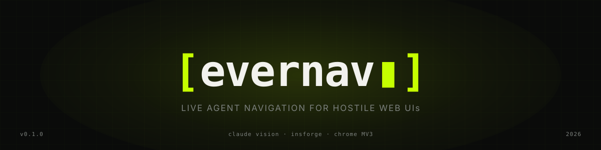
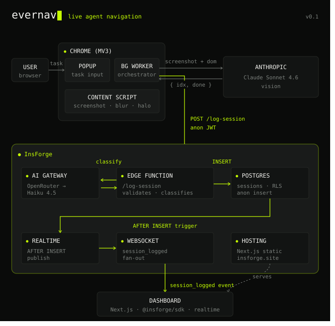

<p align="center">
  
</p>

<p align="center">
  <a href="https://uqi28a23.insforge.site"><b>Live dashboard</b></a> ·
  <a href="#how-it-works">How it works</a> ·
  <a href="#setup">Setup</a>
</p>

A Chrome extension that guides you through complex web UIs.
Type what you want to do, and EverNav blurs the page and glows the exact
element to click. Every completed task is logged to InsForge in real time —
the next agent picks up where the last one left off.

Built for the **Applied Intelligence Hackathon @ Frontier Tower (2026-05-31)**.

## How it works

<p align="center">
  
</p>

Two loops running side by side:

1. **Live guidance loop** — extension screenshots the active tab, sends the screenshot + DOM element list to **Claude Sonnet 4.6 vision** (via the InsForge `vision-pick` edge function), gets back `{idx, instruction, done}`, blurs the page and halos the chosen element. Repeats on every click.

2. **Logging loop** — when the task is done, the extension POSTs to the InsForge **edge function** `log-session`, which calls the InsForge **AI gateway** (OpenRouter → Claude Haiku 4.5) to classify the task into one of `security / navigation / configuration / other`, then inserts the row into the **Postgres** `sessions` table. An `AFTER INSERT` trigger publishes a `session_logged` event over **realtime** WebSockets, fan-out to the **Next.js dashboard** hosted on InsForge — counters tick up and the matching card flashes lime, no refresh.

That's six InsForge surfaces lit up by one user click.

## Repo layout

```
extension/       Chrome MV3 extension (sideload in developer mode)
  lib/           Extracted testable modules (fingerprint, scoring, oscillation, etc.)
dashboard/       Next.js static-export dashboard, deployed via InsForge
functions/       InsForge edge functions (vision-pick, log-session)
services/        Moss vector-search microservice
migrations/      Postgres schema migrations (sessions table, RLS, realtime trigger)
tests/           Vitest unit + E2E tests
docs/            Logo, architecture diagram, demo-day pre-flight
fixtures/        Site hint docs for Moss seeding
scripts/         Moss seeding + demo priming utilities
```

## Setup

### 1. Get your API keys

| Provider | URL | Note |
|---|---|---|
| InsForge | InsForge dashboard | Project URL (`oss_host`) + anon JWT. |

Vision calls route through the InsForge `vision-pick` edge function, which holds the OpenRouter API key server-side. The extension never sees the model key directly.

### 2. Deploy InsForge edge functions

The `functions/` directory contains two Deno edge functions:

- **`vision-pick`** — proxies screenshot + element list to Claude Sonnet 4.6 via OpenRouter, returns `{idx, fid, instruction, done}`.
- **`log-session`** — validates, classifies the task via Claude Haiku 4.5, inserts into the `sessions` table.

Deploy them to your InsForge project. Set the `OPENROUTER_API_KEY` environment variable on the server.

### 3. Run database migrations

Apply the migrations in `migrations/` to your InsForge Postgres instance (in order). These create the `sessions` table, realtime trigger, category column, step summary, and outcome tracking.

### 4. Sideload the extension

```
chrome://extensions  →  Developer mode ON  →  Load unpacked  →  pick extension/
```

Pin the extension. Click the gear icon in the popup → paste your InsForge Project URL and Anon JWT → Save.

### 5. Build + deploy the dashboard

```bash
cd dashboard
cp .env.example .env.local
# edit .env.local with your InsForge project details
npm install
npm run build      # produces ./out
```

Deploy the `out/` directory to InsForge static hosting.

### 6. (Optional) Seed Moss hints

If using the Moss vector-search service for dynamic site hints:

```bash
cd services/moss-query
npm install
node server.js     # runs on port 3033
```

Seed the index:

```bash
MOSS_PROJECT_ID=... MOSS_PROJECT_KEY=... node scripts/seed-moss.js
```

### 7. Demo

1. Open `github.com/settings/tokens`.
2. Click the extension. Type `rotate my personal access token`. Hit **Guide me**.
3. Vision picks each element, blur + glow walks you through.
4. Open the dashboard URL → session count incremented, outcome badge shown.

See `docs/demo-day-checklist.md` for the 15-minute pre-flight and co-driver hot-key map.

## Testing

```bash
npm install
npm test              # 72 tests across 10 files
npm run test:watch    # watch mode
npm run test:coverage # with v8 coverage
```

Tests use Vitest + happy-dom. No browser or network required — all chrome APIs and edge function calls are mocked.

## Security

- API keys live in `chrome.storage.local`, never in the repo.
- Vision calls are proxied through InsForge — the model API key never leaves the server.
- `.env.local` is gitignored. Use `.env.example` as a template.
- **Rotate every key within an hour of demo end** — treat any key that ever existed on the demo laptop as burned.

## Known caveats

- The shipped fallback trail in `fixtures/` is a best-guess. Re-record after the first successful live run.
- Manifest `content_scripts` scope covers github.com, amazon.com, AWS console, claude.ai, and anthropic.com. Adding sites is one line in the manifest + a hint doc.
- Dashboard deploys are static — after upload, edge propagation can take a few minutes.
